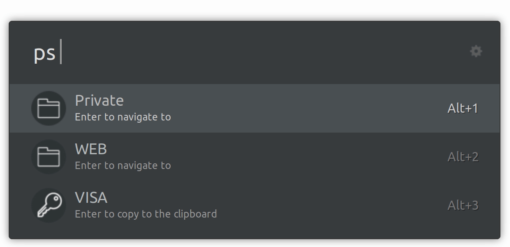

# Ulauncher password-store extension

> A simple [pass](https://www.passwordstore.org/) extension for [Ulauncher](https://ulauncher.io/).

## Development

    $ git clone https://github.com/yannishuber/pass-ulauncher.git
    $ ln -s pass-ulauncher/ ~/.cache/ulauncher_cache/extensions/pass-ulauncher/
 
 In order to see the new extension you have to restart Ulauncher.
 
## TODO
- [x] Information if not all elements are listed
- [ ] List directories first
- [ ] Check user preferences
- [ ] Possibility to add a new password
- [ ] Git controls (push/pull password-store repo)

## Credits
Icons made by [Freepik](https://www.freepik.com/) and [Smashicons](https://www.flaticon.com/authors/smashicons) from [Flaticon](https://www.flaticon.com/).